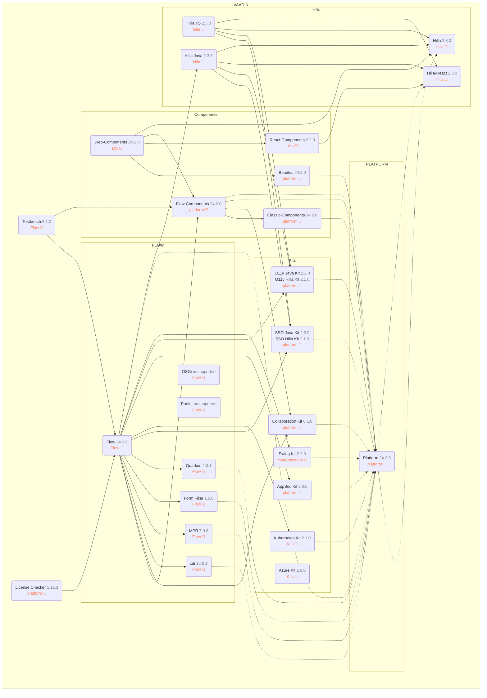

## Platform Modules Build

```mermaid
flowchart TB
    subgraph VAADIN
        TB
        LC
        subgraph PLATFORM
           P
        end
        subgraph FLOW
           F
           CDI
           Q 
           OSGi
           MPR
           FF
           POR
        end  
        subgraph Components
           WC
           FC
           B
           RC
           CC
        end 
        subgraph Kits
            SSO
            O11
            K8S
            SW
            AZ
            CE
            AK
        end   
        subgraph Hilla
            HT
            HJ
            HP
            HR
        end   
    end       

            TB --> F
            TB --> FC

            F --> FC
            F --> CE
            F --> CDI
            F --> MPR
            F --> FF
            F --> Q

            F --> SSO
            F --> K8S
            F --> AK
            F --> O11
            F --> SW


            WC --> B
            WC --> RC
            WC --> FC

            FC --> CC
            FC --> CE

            FC -.-> P
            CC -.-> P
            CE -.-> P

            CDI -.-> P
            MPR -.-> P
            FF -.-> P
            Q -.-> P
            FC  -.-> P
            SSO -.-> P
            SW  -.-> P
            K8S  -.-> P
            AK  -.-> P
            B  -.-> P
            O11 -.-> P
            LC --> F
            F -.-> P 
            F --> HJ


            RC  --> HR

            WC --> HP
            HJ --> SSO
            HJ --> O11
            HT --> SSO
            HT --> O11
            HT --> HP
            HT --> HR
            HJ --> HR
            HJ --> HP
            P -.-> HP
            P -.-> HR


TB(Testbench <span style='color: grey'>9.1.0 <div style='color: coral'>Flow &#128280)

F(Flow <span style='color: grey'>24.2.0 <div style='color: coral'>Flow &#128280)
CDI(cdi <span style='color: grey'>15.0.1 <div style='color: coral'>Flow &#128280)
Q(Quarkus <span style='color: grey'>2.0.1 <div style='color: coral'>Flow &#128280)
MPR(MPR <span style='color: grey'>7.0.8 <div style='color: coral'>Flow &#128280)
FF(Form Filler <span style='color: grey'>1.0.0 <div style='color: coral'>Flow &#128280)
OSGi(OSGi <span style='color: grey'>unsupported <div style='color: coral'>Flow &#128280)
POR(Portlet <span style='color: grey'>unsupported <div style='color: coral'>Flow &#128280)


SSO(SSO Java Kit <span style='color: grey'>2.2.0</span><br/>SSO Hilla Kit <span style='color: grey'>2.1.0</span><div style='color: coral'>platform &#128280</div>)
O11(O11y Java Kit <span style='color: grey'>2.2.0</span><br/>O11y Hilla Kit <span style='color: grey'>2.1.0</span><div style='color: coral'>platform &#128280</div>)
K8S(Kubernetes Kit <span style='color: grey'>2.1.0 <div style='color: coral'>Kits &#128280)
AZ(Azure Kit <span style='color: grey'>1.0.0 <div style='color: coral'>Kits &#128280)
CE(Collaboration Kit <span style='color: grey'>6.1.0 <div style='color: coral'>platform &#128280)
SW(Swing Kit <span style='color: grey'>2.2.0 <div style='color: coral'>modernization &#128280)
AK(AppSec Kit <span style='color: grey'>3.0.0 <div style='color: coral'>platform &#128280)

WC(Web-Components <span style='color: grey'>24.2.0 <div style='color: coral'>DS &#128280)
B(Bundles <span style='color: grey'>24.2.0 <div style='color: coral'>platform &#128280)
RC(React-Components <span style='color: grey'>2.2.0 <div style='color: coral'>hilla &#128280)
FC(Flow-Components <span style='color: grey'>24.2.0 <div style='color: coral'>platform &#128280)


CC(Classic-Components <span style='color: grey'>24.2.0 <div style='color: coral'>platform &#128280)
P(Platform <span style='color: grey'>24.2.0 <div style='color: coral'>platform &#128280)

HT(Hilla TS <span style='color: grey'>2.3.0 <div style='color: coral'>hilla &#128280)
HJ(Hilla Java <span style='color: grey'>2.3.0 <div style='color: coral'>hilla &#128280)
HP(Hilla <span style='color: grey'>2.3.0 <div style='color: coral'>hilla &#128280)
HR(Hilla-React <span style='color: grey'>2.3.0 <div style='color: coral'>hilla &#128280)

LC(License Checker <span style='color: grey'>1.12.3 <div style='color: coral'>platform &#128280)


```