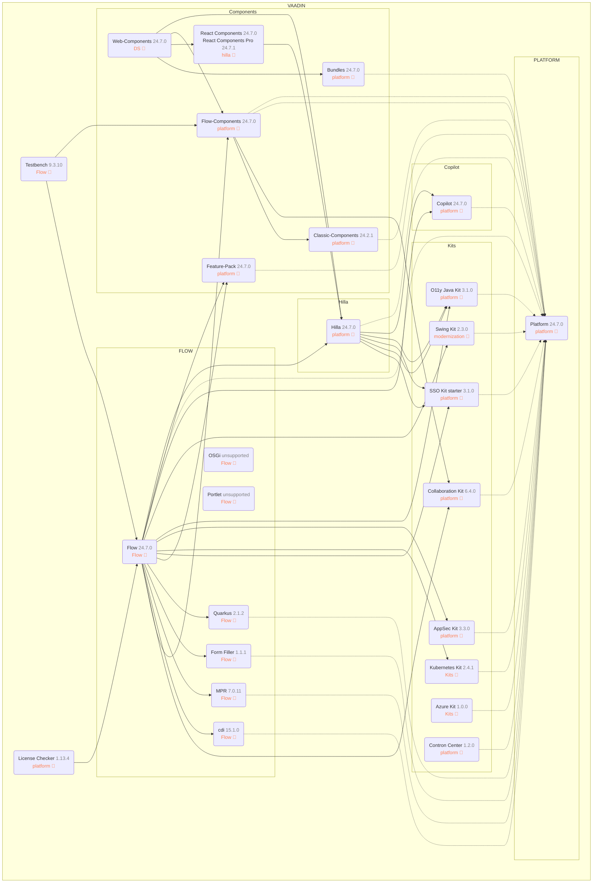

## Platform Modules Build

```mermaid
flowchart TB
    subgraph VAADIN
        TB
        LC
        subgraph PLATFORM
           P
        end
        subgraph FLOW
           F
           CDI
           Q 
           OSGi
           MPR
           FF
           POR
        end  
        subgraph Components
           WC
           FC
           B
           RC
           CC
           FP
        end
        subgraph Kits
            SSO
            O11
            K8S
            SW
            AZ
            CE
            AK
            ConC
        end   
        subgraph Hilla
            H
        end
        subgraph Copilot
            CO
        end   
    end       

            TB --> F
            TB --> FC

            F --> FC
            F --> CE
            F --> CDI
            F --> MPR
            F --> FF
            F --> Q
            F --> FP

            F --> SSO
            F --> K8S
            F --> AK
            F --> O11
            F --> SW
            F --> CO

            WC --> B
            WC --> RC
            WC --> FC

            FC --> CC
            FC --> CE
            F --> FP

            FC -.-> P
            FP -.-> P
            CC -.-> P
            CE -.-> P

            CDI -.-> P
            MPR -.-> P
            FF -.-> P
            Q -.-> P
            FC  -.-> P
            SSO -.-> P
            SW  -.-> P
            K8S  -.-> P
            AK  -.-> P
            B  -.-> P
            O11 -.-> P
            CO -.-> P
            LC --> F
            F -.-> P 
            F --> H
            AZ -.-> P
            ConC -.-> P

            RC  --> H

            WC --> H
            H --> SSO
            H --> O11
            H --> SSO
            H --> O11
            H --> CO
            H -.-> P


TB(Testbench <span style='color: grey'>9.3.10 <div style='color: coral'>Flow &#128280)

F(Flow <span style='color: grey'>24.7.0 <div style='color: coral'>Flow &#128280)
CDI(cdi <span style='color: grey'>15.1.0 <div style='color: coral'>Flow &#128280)
Q(Quarkus <span style='color: grey'>2.1.2 <div style='color: coral'>Flow &#128280)
MPR(MPR <span style='color: grey'>7.0.11 <div style='color: coral'>Flow &#128280)
FF(Form Filler <span style='color: grey'>1.1.1 <div style='color: coral'>Flow &#128280)
OSGi(OSGi <span style='color: grey'>unsupported <div style='color: coral'>Flow &#128280)
POR(Portlet <span style='color: grey'>unsupported <div style='color: coral'>Flow &#128280)

SSO(SSO Kit starter <span style='color: grey'>3.1.0</span><div style='color: coral'>platform &#128280</div>)
O11(O11y Java Kit <span style='color: grey'>3.1.0</span><div style='color: coral'>platform &#128280</div>)
K8S(Kubernetes Kit <span style='color: grey'>2.4.1 <div style='color: coral'>Kits &#128280)
AZ(Azure Kit <span style='color: grey'>1.0.0 <div style='color: coral'>Kits &#128280)
CE(Collaboration Kit <span style='color: grey'>6.4.0 <div style='color: coral'>platform &#128280)
SW(Swing Kit <span style='color: grey'>2.3.0 <div style='color: coral'>modernization &#128280)
AK(AppSec Kit <span style='color: grey'>3.3.0 <div style='color: coral'>platform &#128280)
ConC(Contron Center <span style='color: grey'>1.2.0 <div style='color: coral'>platform &#128280)

WC(Web-Components <span style='color: grey'>24.7.0 <div style='color: coral'>DS &#128280)
B(Bundles <span style='color: grey'>24.7.0 <div style='color: coral'>platform &#128280)
RC(React Components <span style='color: grey'>24.7.0</span><br/>React Components Pro <span style='color: grey'>24.7.1</span><div style='color: coral'>hilla &#128280</div>)
FC(Flow-Components <span style='color: grey'>24.7.0 <div style='color: coral'>platform &#128280)
FP(Feature-Pack <span style='color: grey'>24.7.0 <div style='color: coral'>platform &#128280)

CC(Classic-Components <span style='color: grey'>24.2.1 <div style='color: coral'>platform &#128280)
P(Platform <span style='color: grey'>24.7.0 <div style='color: coral'>platform &#128280)

H(Hilla <span style='color: grey'>24.7.0 <div style='color: coral'>platform &#128280)
CO(Copilot <span style='color: grey'>24.7.0 <div style='color: coral'>platform &#128280)

LC(License Checker <span style='color: grey'>1.13.4 <div style='color: coral'>platform &#128280)

```
